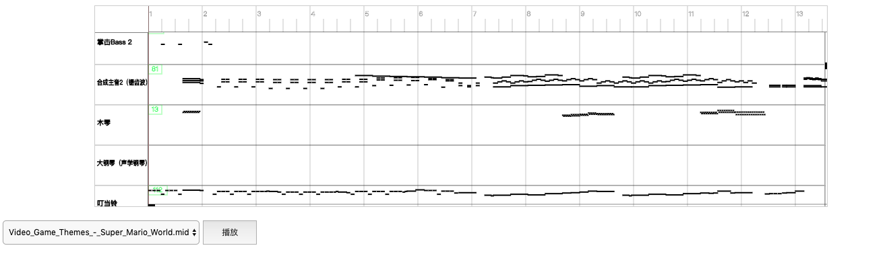
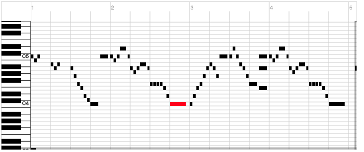

https://webpack.js.org/guides/getting-started/

https://webpack.js.org/guides/typescript/


https://github.com/Tonejs/Tone.js

```
npm run build
```

use:

npm i midi-view

html:

```html
  <div id="midi-view">
    <canvas></canvas>
  </div>
  <select id="midi-select"> </select>
  <button id="btn_paly">播放</button>
```

css:

```css
  #midi-view {
    width: 80%;
    min-height: 50px;
    height: 300px;
    background: gray;
    margin: 0 auto;
    margin-top: 10px;
}

button {
    width: 80px;
    height: 36px;
}

select {
    min-width: 80px;
    height: 36px;
    margin-top: 20px;
}

canvas {
    width: 100%;
    height: 100%;
}
```

script:

```javascript

const midiview = require("midi-view")

var playing = false;
var view = document.querySelector("#midi-view")
view = new midiview.MidiView(view)
// view = new midiview.MidiView(view , "light") // default black white blue

var btn = document.querySelector("#btn_paly");

function play(){
    try {
        if (playing) {
          btn.textContent = "播放";
          view.stop()
        } else {
          btn.textContent = "暂停";
          view.play()
        }
    } finally {
        playing = !playing
    }
}

btn.addEventListener("click", play)

var select = document.querySelector("#midi-select");
select.addEventListener("change", () => {
    view.loadFromUrl(select.value).catch(e=>{
        console.error(e);
    });
});
```

preview:






API:

MidiView

- play
- stop
- loadFromUrl
- loadFromData
- destroy
- setTheme: default,black,blue,light

wheel:

- wheel : y scroll
- ALT + wheel : x scroll
- CTRL + wheel : x scale
- SHIFT + wheel : y scale
- CTRL + SHIFT + wheel : x、y scale